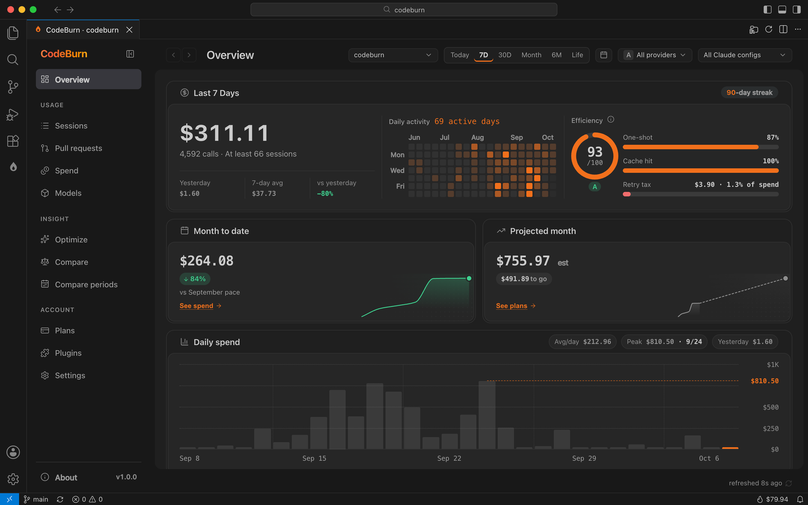
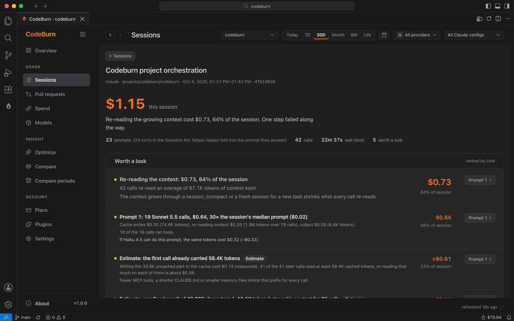
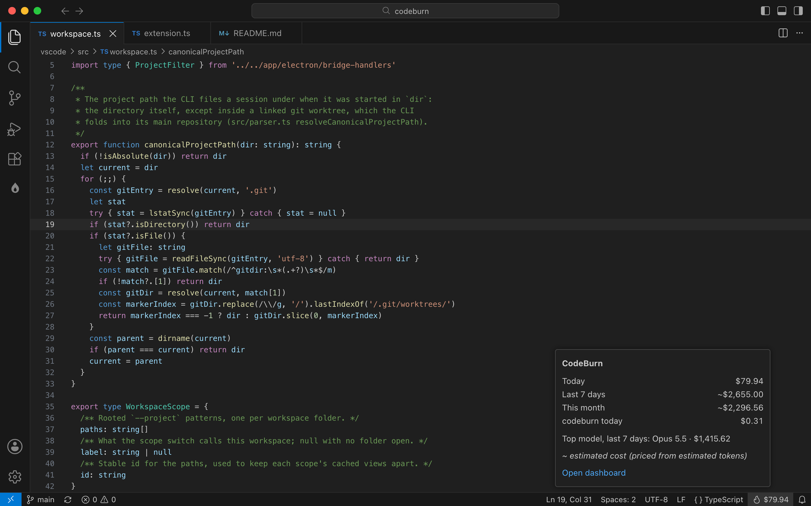
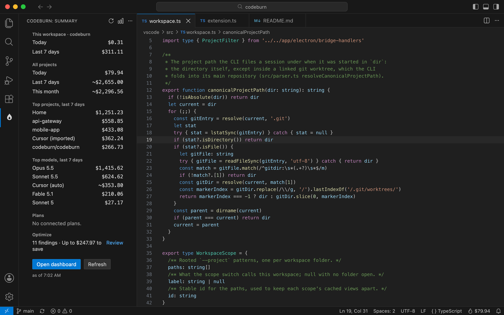
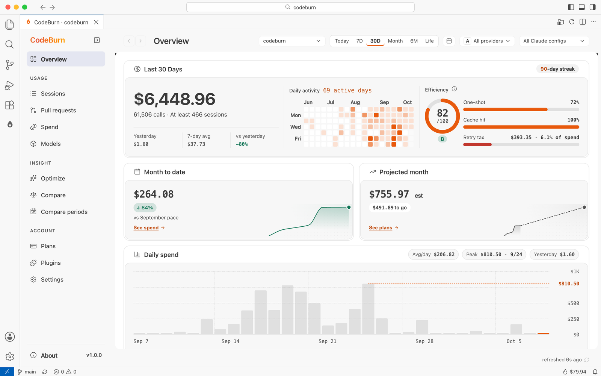

# CodeBurn for VS Code

See where your AI coding spend goes without leaving the editor: by project, model, session, pull request and day, for Claude Code, Codex, Cursor, Copilot, Gemini, OpenCode and every other tool the CodeBurn CLI reads.

CodeBurn reads the session logs these tools already write on your machine. Nothing is uploaded, and the extension sends no telemetry.

The Overview for this workspace: spend, activity, efficiency and the month so far.

Why a session cost what it did, with the prompts worth a look ranked by cost.

Today's spend in the status bar. Hover for the week, the month and this workspace.

The activity bar summary: this workspace, all projects, top projects and models, and Optimize.

It follows your editor's theme: light, dark or high contrast.

## What you get

- **Status bar.** Today's spend, with `~` when part of it is estimated. Hover for this week, this month, this workspace, the top model and every plan quota with its reset time. Click to open the dashboard.
- **Activity bar summary.** This workspace's spend, all projects for today, 7 days and this month, the top projects and models, quota bars and the Optimize findings, with quick actions.
- **Dashboard.** The full CodeBurn desktop dashboard in an editor tab: Overview, Sessions with the per-session "why it cost" view, Pull requests, Spend, Models, Optimize, Compare, Compare periods, Plans and Settings.
- **Workspace aware.** The dashboard opens on the current workspace's projects. Switch to all projects from the scope menu or the editor title bar. A workspace counts the sessions started in its folders or below; a linked git worktree counts toward its main repository, the same way the CLI files it.
- **Native look.** Follows your light, dark or high contrast theme in VS Code and its forks, in English, French, Japanese, Korean and Chinese (Simplified and Traditional), following the editor's display language.

## Commands

All under **CodeBurn** in the Command Palette:

| Command | What it does |
|:--|:--|
| Open Dashboard | Opens the dashboard in an editor tab |
| Refresh | Re-reads usage for the status bar, the summary and the dashboard |
| Show Today | Opens the Overview on today |
| Show This Workspace | Scopes the dashboard to this workspace's projects |
| Show All Projects | Scopes the dashboard to every project |
| Open Optimize | Opens the Optimize findings |
| Copy Summary | Copies a plain-text summary for a chat or a standup note |
| Open Settings | Opens CodeBurn's settings |
| Star on GitHub | Opens CodeBurn's GitHub page |

## Settings

| Setting | Default | |
|:--|:--|:--|
| `codeburn.workspaceOnly` | `true` | Open the dashboard on this workspace's projects |
| `codeburn.defaultPeriod` | `today` | The period the dashboard opens on |
| `codeburn.refreshInterval` | `1m` | `manual`, `30s`, `1m`, `3m`, `5m` or `10m`. Only a focused window or a visible summary refreshes |
| `codeburn.statusBar.format` | `cost` | `cost`, `costAndQuota`, `workspace` or `hidden` |
| `codeburn.currency` | empty | A three-letter code. Changes the CodeBurn CLI's currency, shared with every CodeBurn app |
| `codeburn.provider` | `all` | Count one provider in the status bar and summary |
| `codeburn.quotaProviders` | all | Plans whose quota CodeBurn checks |
| `codeburn.nodePath` | empty | A Node.js 22.13+ to run the CLI with, if the editor's own is too old |

## Requirements

Nothing to install. The CodeBurn CLI ships inside the extension and runs on the editor's built-in Node.js. Current VS Code, Cursor and Antigravity ship Node 24, which is all the CLI needs.

On an older editor whose Node is below 22.13, CodeBurn looks for a Node.js 22.13 or later on your machine and uses that. If there is none, it runs on the editor's Node and says which tools it cannot read: Cursor, OpenCode and Copilot usage needs `node:sqlite`. Install Node 22 or set `codeburn.nodePath`.

## Privacy

- Session logs are read locally by the bundled CLI. Your prompts, code, file names and project names never leave your machine.
- The extension has no telemetry.
- The bundled CLI makes the same few requests it makes anywhere: model prices from LiteLLM and exchange rates (for a non-USD currency), each at most once a day, and, if you use Cursor, your own usage export from cursor.com with the Cursor app's login. `"cursorSync": false` in `~/.config/codeburn/config.json` turns that off.
- Some dashboard actions reach the network only when you run them: scanning your local network for other devices, sharing a report, pushing usage to your own OTLP endpoint (sync, off until you set it up) and adding a plugin.
- Plan quotas are read from each provider's own API with the login already on your machine, the same requests the CodeBurn desktop app makes. Remove a provider from `codeburn.quotaProviders` to stop them.

## Works in

VS Code 1.82 or later, and the editors built on it: Cursor, Windsurf, Antigravity and VSCodium. Uses no proposed APIs.

## More

CodeBurn is open source under the MIT license: [github.com/getagentseal/codeburn](https://github.com/getagentseal/codeburn). The same data is in the CLI (`npx codeburn`), the desktop app and the menu bar apps.
